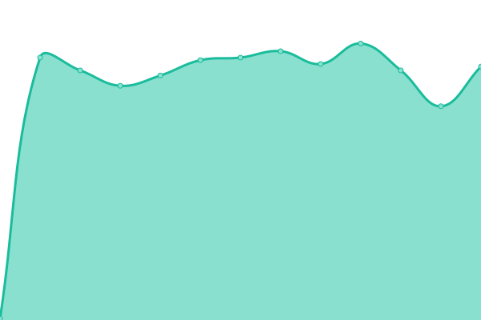
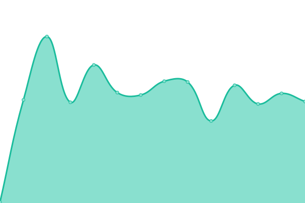
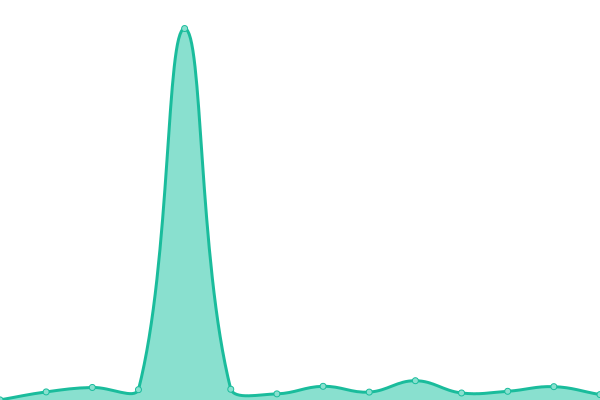
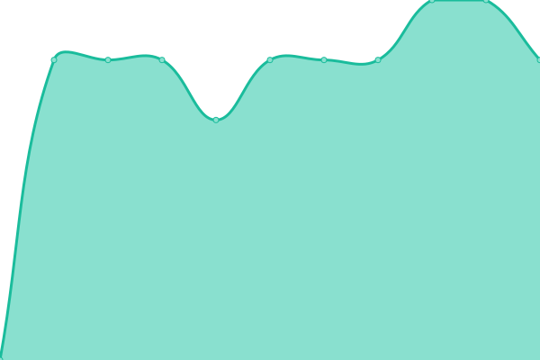

# [📈 Live Status](https://kreisklasse.github.io/upptime): <!--live status--> **🟩 All systems operational**

This repository contains the open-source uptime monitor and status page for [kreisklasse](https://kreisklasse.github.io/upptime), powered by [Upptime](https://github.com/upptime/upptime).

With [Upptime](https://upptime.js.org), you can get your own unlimited and free uptime monitor and status page, powered entirely by a GitHub repository. We use [Issues](https://github.com/kreisklasse/upptime/issues) as incident reports, [Actions](https://github.com/kreisklasse/upptime/actions) as uptime monitors, and [Pages](https://kreisklasse.github.io/upptime) for the status page.

<!--start: status pages-->
<!-- This summary is generated by Upptime (https://github.com/upptime/upptime) -->
<!-- Do not edit this manually, your changes will be overwritten -->
<!-- prettier-ignore -->
| URL | Status | History | Response Time | Uptime |
| --- | ------ | ------- | ------------- | ------ |
|  [A310.net](https://a310.net/) | 🟩 Up | [a310-net.yml](https://github.com/kreisklasse/upptime/commits/HEAD/history/a310-net.yml) | 

 404ms
     
 | 

<a href="https://kreisklasse.github.io/upptime/history/a310-net">100.00%</a>
    

|  [Time.is](https://time.is) | 🟩 Up | [time-is.yml](https://github.com/kreisklasse/upptime/commits/HEAD/history/time-is.yml) | 

 183ms
     
 | 

<a href="https://kreisklasse.github.io/upptime/history/time-is">98.42%</a>
    

|  [protective.joindns4.eu DNS ipv4 DOH](protective.joindns4.eu) | 🟩 Up | [protective-joindns4-eu-dns-ipv4-doh.yml](https://github.com/kreisklasse/upptime/commits/HEAD/history/protective-joindns4-eu-dns-ipv4-doh.yml) | 

 27ms
     
 | 

<a href="https://kreisklasse.github.io/upptime/history/protective-joindns4-eu-dns-ipv4-doh">100.00%</a>
    

|  [wolf-smartset.com](https://www.wolf-smartset.com) | 🟩 Up | [wolf-smartset-com.yml](https://github.com/kreisklasse/upptime/commits/HEAD/history/wolf-smartset-com.yml) | 

 517ms
     
 | 

<a href="https://kreisklasse.github.io/upptime/history/wolf-smartset-com">100.00%</a>
    

|  [checkonline.home-assistant.io](checkonline.home-assistant.io) | 🟩 Up | [checkonline-home-assistant-io.yml](https://github.com/kreisklasse/upptime/commits/HEAD/history/checkonline-home-assistant-io.yml) | 

 6ms
     
 | 

<a href="https://kreisklasse.github.io/upptime/history/checkonline-home-assistant-io">100.00%</a>
    

<!--end: status pages-->

[**Visit our status website →**](https://kreisklasse.github.io/upptime)

## 📄 License

- Powered by: [Upptime](https://github.com/upptime/upptime)
- Code: [MIT](./LICENSE) © [Anand Chowdhary](https://anandchowdhary.com), supported by [Pabio](https://pabio.com)
- Data in the `./history` directory: [Open Database License](https://opendatacommons.org/licenses/odbl/1-0/)
